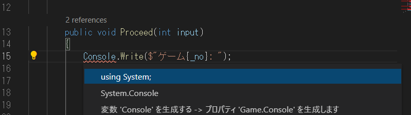

# 進歩したコンソールアプリを作ってみよう

## コード改善機能でエラーを消す

Visual Studio Code は非常に素晴らしいのでプログラムコードの改善ポイントを教えてくれる機能があります。  
今回はこの機能を頼ってエラーをどう消せばよいか教えてもらいましょう。  

- エラーが発生している場所、今回ならば ```Console.``` という場所にカーソルを合わせて [ Ctrl+. ] または [ &#8984;. ]を押します。  
- ```uging System;``` を選択し Enter を押します。



すると **Game.cs** ファイルの先頭に ```using System;``` と追加されエラーがなくなります。  

最終的な **Game.cs** クラスは次のようになります。
```cs
using System;

internal class Game
{
    int _no { get; init; }
    int _answer { get; init; }
    public bool Cleared { get; private set; }

    public Game(int no)
    {
        _no = no;
        _answer = new System.Random().Next(1, 9);
    }

    public void Proceed(int input)
    {
        Console.Write($"ゲーム{_no}: ");
        if (Cleared)
        {
            Console.WriteLine("クリア済みです");
            return;
        }
        if (input > _answer)
        {
            Console.WriteLine("答えはもっと小さい値です");
            return;
        }
        if (input < _answer)
        {
            Console.WriteLine("答えはもっと大きい値です");
            return;
        }
        Console.WriteLine("正解！ クリアです");
        Cleared = true;
    }
}
```

# 完成

これで **進歩したコンソールアプリ** は完成です。実行して遊んでみましょう。  

## 自習 - アプリの改善

今回作った数当てゲームはまだ不親切な部分があります。C# の学習としてぜひ自分で機能を追加してみてください。  

### 機能の例

- 正解を当てるまでにかかった回数を数えて表示する機能
- 1 ゲームごとに終了するのではなく、連続で遊べる機能
- 数字でなく単語を当てる機能

**あなたに、素晴らしい C# エンジニアライフを！**

<hr />

[< 前へ](./textbook_advanced07.md)

[[ C# でアプリを作る ] へ](../../textbook/practice.md)