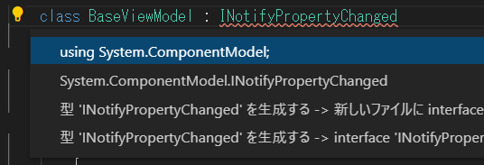

# WPF アプリを作ってみよう

### 画面の動作を書く場所を作る

まずはファイル内に画面の動作を書く場所を作ります。次のプログラムコードを書き足します。書き足す場所はファイル最後の ```}``` の上です。
```cs
class MainWindowViewModel
{
    
}
```

書き足し後の **MainWindow.xaml.cs** は次のようになります。  
**書き足し後**
```cs
using System;
using System.Collections.Generic;
using System.Linq;
using System.Text;
using System.Threading.Tasks;
using System.Windows;
using System.Windows.Controls;
using System.Windows.Data;
using System.Windows.Documents;
using System.Windows.Input;
using System.Windows.Media;
using System.Windows.Media.Imaging;
using System.Windows.Navigation;
using System.Windows.Shapes;

namespace WpfApp
{
    /// <summary>
    /// Interaction logic for MainWindow.xaml
    /// </summary>
    public partial class MainWindow : Window
    {
        public MainWindow()
        {
            InitializeComponent();
        }
    }

    class MainWindowViewModel
    {
        
    }
}
```

ここまで書くとアプリを実行できるので、一度実行してみましょう、もしエラーで実行できない場合は、これまでの内容や、完成コードなどを参考にプログラムコードを見直してください。  

メニューの ```実行 > デバッグの開始``` で実行します。  

画面が表示されれば成功です。まだ画面の動作は作っていないので、表示されることを確認したが画面右上の「×」ボタンでアプリを終了します。  

### 定型処理を作る

WPF アプリを作る場合、```ICommand``` の実装、```INotifyPropertyChanged``` の実装というプログラムコードが必要です。これは現段階では難しいコードですが、最初は毎回同じコードをコピーして組み込んでしまえば大丈夫です。今後学習が進んで理解できるようになるまでは次のプログラムコードをコピーして使ってください。今回もコピーして使います。
```cs
class Command : ICommand
{
    public Action<object> Action;
    bool _canExecute = true;
    public event EventHandler CanExecuteChanged;

    public Command(Action<object> execute)
    {
        Action = execute;
    }

    public void SetCanExecute(bool canExecute)
    {
        _canExecute = canExecute;
        CanExecuteChanged?.Invoke(null, EventArgs.Empty);
    }

    public bool CanExecute(object parameter)
    {
        return _canExecute;
    }

    public void Execute(object parameter)
    {
        Action?.Invoke(parameter);
    }
}

class BaseViewModel : INotifyPropertyChanged
{
    public event PropertyChangedEventHandler PropertyChanged;

    protected bool SetProperty<T>(ref T property, T value, [CallerMemberName] string propertyName = null)
    {
        if (object.Equals(property, value))
        {
            return false;
        }
        property = value;
        PropertyChanged?.Invoke(this, new PropertyChangedEventArgs(propertyName));
        return true;
    }
}
```
また、画面の動作を書く場所として作った、
```cs
class MainWindowViewModel
{
    
}
```
も少し変更します。  

**変更後**
```cs
class MainWindowViewModel : BaseViewModel
{
    
}
```
``` : BaseViewModel``` を書き足しています。これは継承という高度な機能を使うプログラムコードです。今回はとりあえずコードを書いて動かしてみることを目的としていますので高度な機能の説明は割愛します。  
**※今回は簡略化のために割愛しますが、今後自身でアプリを作って行くには必須知識です。別途しっかり学んでください。**  

ここまで書いた状態でプログラムコードの一部に赤い波線がついてエラーが出ているはずです。

### コード改善機能でエラーを消す

Visual Studio Code は非常に素晴らしいのでプログラムコードの改善ポイントを教えてくれる機能があります。  
今回はこの機能を頼ってエラーをどう消せばよいか教えてもらいましょう。

- エラーが発生している場所、今回ならば ```INotifyPropertyChanged``` という場所にカーソルを合わせて [ Ctrl+. ] を押します。
- ```using System.ComponentModel;``` を選択し Enter を押します。



同じように ```CallerMemberName``` でもエラーが出ているので、同じことをします。  

- ```CallerMemberName``` という場所にカーソルを合わせて [ Ctrl+. ] を押します。
- ```using System.Runtime.CompilerServices;``` を選択し Enter を押します。

すると **MainWindow.xaml.cs** ファイルの先頭に ```using System.ComponentModel;``` ```using System.Runtime.CompilerServices;``` が追加されエラーがなくなります。

現在の **MainWindow.xaml.cs** は次のようになります。
```cs
using System;
using System.Collections.Generic;
using System.ComponentModel;
using System.Linq;
using System.Runtime.CompilerServices;
using System.Text;
using System.Threading.Tasks;
using System.Windows;
using System.Windows.Controls;
using System.Windows.Data;
using System.Windows.Documents;
using System.Windows.Input;
using System.Windows.Media;
using System.Windows.Media.Imaging;
using System.Windows.Navigation;
using System.Windows.Shapes;

namespace WpfApp
{
    /// <summary>
    /// Interaction logic for MainWindow.xaml
    /// </summary>
    public partial class MainWindow : Window
    {
        public MainWindow()
        {
            InitializeComponent();
        }
    }

    class Command : ICommand
    {
        public Action<object> Action;
        bool _canExecute = true;
        public event EventHandler CanExecuteChanged;

        public Command(Action<object> execute)
        {
            Action = execute;
        }

        public void SetCanExecute(bool canExecute)
        {
            _canExecute = canExecute;
            CanExecuteChanged?.Invoke(null, EventArgs.Empty);
        }

        public bool CanExecute(object parameter)
        {
            return _canExecute;
        }

        public void Execute(object parameter)
        {
            Action?.Invoke(parameter);
        }
    }

    class BaseViewModel : INotifyPropertyChanged
    {
        public event PropertyChangedEventHandler PropertyChanged;

        protected bool SetProperty<T>(ref T property, T value, [CallerMemberName] string propertyName = null)
        {
            if (object.Equals(property, value))
            {
                return false;
            }
            property = value;
            PropertyChanged?.Invoke(this, new PropertyChangedEventArgs(propertyName));
            return true;
        }
    }
    class MainWindowViewModel : BaseViewModel
    {

    }
}
```

<hr />

[< 前へ](./textbook01.md) | [次へ >](./textbook03.md)  

[[ C# でアプリを作る ] へ](../../textbook/practice.md)
