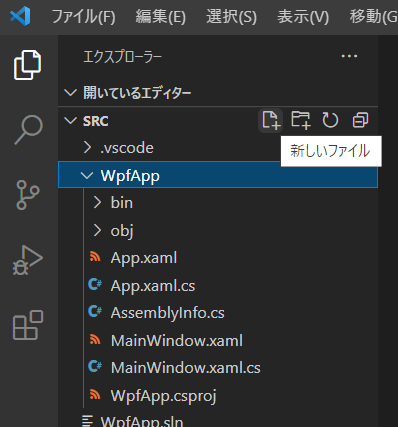

# 進歩した WPF アプリを作ってみよう

## 変更後のプログラムコード

**クラス** を使うように変更したプログラムコードはこのようになります。

**変更後**
```cs
class MainWindowViewModel : BaseViewModel
{
    public Command AnswerCommand { get; }
    public string Input { get; set; }
    Game _game1 = new Game(1);
    Game _game2 = new Game(2);
    string _message;
    public string Message
    {
        get { return _message; }
        set { SetProperty(ref _message, value); }
    }

    public MainWindowViewModel()
    {
        AnswerCommand = new Command(OnAnswerCommand);
    }

    void OnAnswerCommand(object parameter)
    {
        if (!int.TryParse(Input, out var input))
        {
            Message = "{Input} → 数字を入力してください";
            return;
        }
        if (input < 1 || input > 9)
        {
            Message = "{Input} → 1-9 の数字を 1 文字入力してください";
            return;
        }
        Message = $"{_game1.Proceed(input)}\n{_game2.Proceed(input)}";
        if (!_game1.Cleared || !_game2.Cleared)
        {
            return;
        }
        Message += "\nゲームクリア！\n終了するには右上の × ボタンを押してください... ";
        AnswerCommand.SetCanExecute(false);
    }
}
```

また、```Proceed``` メソッドは **クラス** の中に書いたので、これまでの ```Proceed``` メソッドは削除します。  

## クラスを使ったプログラムコード

ひとまず、**クラス** を使ったプログラムコードが出来上がりました。現在のプログラムコードは次のようになっています。
```cs
using System;
using System.Collections.Generic;
using System.ComponentModel;
using System.Linq;
using System.Runtime.CompilerServices;
using System.Text;
using System.Threading.Tasks;
using System.Windows;
using System.Windows.Controls;
using System.Windows.Data;
using System.Windows.Documents;
using System.Windows.Input;
using System.Windows.Media;
using System.Windows.Media.Imaging;
using System.Windows.Navigation;
using System.Windows.Shapes;

namespace WpfApp
{
    /// <summary>
    /// Interaction logic for MainWindow.xaml
    /// </summary>
    public partial class MainWindow : Window
    {
        public MainWindow()
        {
            InitializeComponent();
        }
    }

    class Command : ICommand
    {
        public Action<object> Action;
        bool _canExecute = true;
        public event EventHandler CanExecuteChanged;

        public Command(Action<object> execute)
        {
            Action = execute;
        }

        public void SetCanExecute(bool canExecute)
        {
            _canExecute = canExecute;
            CanExecuteChanged?.Invoke(null, EventArgs.Empty);
        }

        public bool CanExecute(object parameter)
        {
            return _canExecute;
        }

        public void Execute(object parameter)
        {
            Action?.Invoke(parameter);
        }
    }

    class BaseViewModel : INotifyPropertyChanged
    {
        public event PropertyChangedEventHandler PropertyChanged;

        protected bool SetProperty<T>(ref T property, T value, [CallerMemberName] string propertyName = null)
        {
            if (object.Equals(property, value))
            {
                return false;
            }
            property = value;
            PropertyChanged?.Invoke(this, new PropertyChangedEventArgs(propertyName));
            return true;
        }
    }

    class MainWindowViewModel : BaseViewModel
    {
        public Command AnswerCommand { get; }
        public string Input { get; set; }
        Game _game1 = new Game(1);
        Game _game2 = new Game(2);
        string _message;
        public string Message
        {
            get { return _message; }
            set { SetProperty(ref _message, value); }
        }

        public MainWindowViewModel()
        {
            AnswerCommand = new Command(OnAnswerCommand);
        }

        void OnAnswerCommand(object parameter)
        {
            if (!int.TryParse(Input, out var input))
            {
                Message = "{Input} → 数字を入力してください";
                return;
            }
            if (input < 1 || input > 9)
            {
                Message = "{Input} → 1-9 の数字を 1 文字入力してください";
                return;
            }
            Message = $"{_game1.Proceed(input)}\n{_game2.Proceed(input)}";
            if (!_game1.Cleared || !_game2.Cleared)
            {
                return;
            }
            Message += "\nゲームクリア！\n終了するには右上の × ボタンを押してください... ";
            AnswerCommand.SetCanExecute(false);
        }
    }

    internal class Game
    {
        int _no { get; init; }
        int _answer { get; init; }
        public bool Cleared { get; private set; }

        public Game(int no)
        {
            _no = no;
            _answer = new System.Random().Next(1, 9);
        }

        public string Proceed(int input)
        {
            var no = $"ゲーム{_no}: ";
            if (Cleared)
            {
                return $"{input} → {no}クリア済みです";
            }
            if (input > _answer)
            {
                return $"{input} → {no}答えはもっと小さい値です";
            }
            if (input < _answer)
            {
                return $"{input} → {no}答えはもっと大きい値です";
            }
            Cleared = true;
            return $"{input} → {no}正解！ クリアです";
        }
    }
}
```

## クラスを別のファイルに書く

**メソッド**、**クラス** を使ってプログラムコードを改善してきました。しかしこれまでの知識だけでは大規模なアプリを作る際に大きな課題に直面します。その課題とは、プログラムコードを一つのファイルに書いていることです。複雑な処理を行うアプリになると、何十万行・何百万行とプログラムコードも大きくなっていきます。それを一つのファイルにすべて書くというのは非現実的です。  
一つのファイルにどのくらいの行数のプログラムコードがかかれるのが適切かは状況によって異なりますが、どのような状況でも一つのファイルが 400 行を超えるようだと何かが間違っていると考えた方が良いです。  

## 新しいファイルを作成する

**Program.cs** と同じディレクトリ(**※1**)に新しいファイルを作成します。作成方法はなんでも良い(**※2**)のですが今回は Visual Studio Code から作ってみます。  



- Visual Studio Code のエクスプローラー ペインで **WpfApp** を選択します。
- Visual Studio Code のエクスプローラー ペインでマウスカーソルをかさねると「新しいファイル」と表示されるアイコンをクリックします。
- **Game.cs** と入力し、Enter キーを押します。

これでファイルが作られて Visual Studio Code で開かれます。簡単ですね。  

**※1**： 同一ディレクトリでなくとも配下のディレクトリであれば読み込んでくれます。規模が大きくなったらディレクトリで整理をすることになります。  
**※2**： そこにファイルがあれば読み込んでくれるので、他の場所からコピーする・ターミナル(端末)で作る・エクスプローラー/Finder で作る、などどのような方法で作ってもかまいません。  

## ファイル名について

C# のプログラムコードを書くファイルのファイル名は拡張子を **.cs** にする必要がます。名前は自由につけて構いません。  

パソコンを買って買ったままの設定で使っていると、拡張子が見えない状態になっているかもしれません。  
インターネット検索などで、拡張子を表示する方法を探して設定を行っておくのがオススメです。プログラミングを行う際には拡張子が非常に重要で常に意識しておく必要があります。また、日常でパソコンを使っている場合にはあまりないかもしれませんが、拡張子を変更する機会もかなりの頻度で発生します。IT エンジニアがパソコンを買ってまず真っ先に設定するものと言って過言ではない設定の一つです。

<hr />

[< 前へ](./textbook_advanced05.md) | [次へ >](./textbook_advanced07.md)  

[[ C# でアプリを作る ] へ](../../textbook/practice.md)